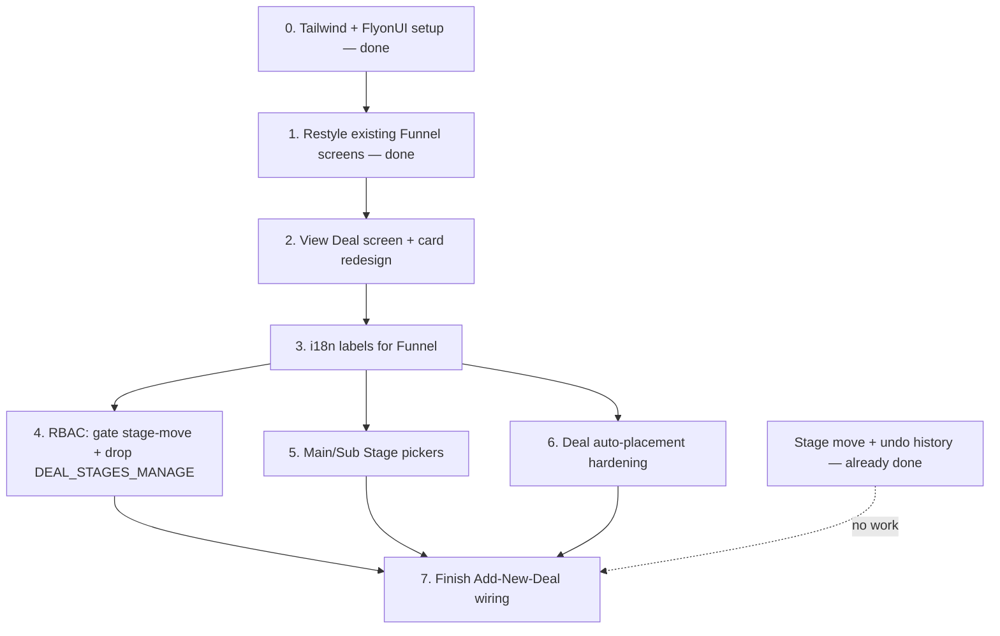

# Funnel (Deal Management) — Development Plan

**Author:** Paige (Technical Writer) · **Reviewed by:** Winston (System Architect)
**Scope:** Finish the Funnel/Deal Management feature. Sequencing is frontend-first: finish the
entire frontend side of Funnel (restyle, View Deal screen + card redesign, i18n labels) before
touching any backend wiring — RBAC, picker APIs, auto-placement, and full Add-New-Deal
persistence all come after, one at a time. Also includes the Funnel-specific slice of two
supervisor-directed, system-wide changes (permission model, RBAC-vs-picker route classification);
the rest of those changes, covering every other already-built section, is tracked separately in
`_bmad-output/6-finished-archive/todo-system-wide-i18n-and-permissions.md`.

## Frontend pages involved

Every route and component that makes up the Funnel/Deal Management feature today.

| File | Role | Styling today |
|---|---|---|
| `frontend/src/app/[tenant]/(dashboard)/funnel/page.tsx` | Tenant-wide Funnel overview route — fetches deals, sources, departments, countries, stages, then renders `FunnelSourceTabs` | N/A — no markup of its own |
| `frontend/src/app/[tenant]/(dashboard)/deals/[id]/page.tsx` | Per-Main-Stage board route — same `FunnelSourceTabs`, scoped to one Main Stage's own Sub Stages | N/A — no markup of its own |
| `frontend/src/components/funnel/FunnelSourceTabs.tsx` | Tabs (All/Customers/Direct/etc.), Department/Country filters, search, and the stage-move + 30s undo grace-period logic | ✅ Tailwind |
| `frontend/src/components/funnel/FunnelBoard.tsx` | The drag-and-drop column board itself; `DealCard` is defined inline in this file (not a separate component) | ✅ Tailwind |
| `frontend/src/components/funnel/AddDealDialog.tsx` | The "Add New Deal" dialog — all 7 tabs (Deal Information, Delivery, Costing, Documents, Notes, Competition, Team) | ✅ Tailwind |
| `frontend/src/components/funnel/DealStageHistoryDialog.tsx` | Read-only viewer for a deal's stage-move history, opened from a `DealCard` icon | ✅ Tailwind |
| `frontend/src/components/funnel/DealDetailDialog.tsx` *(new, Task 2)* | Full deal-detail view — does not exist yet | N/A — new file, built with Tailwind/FlyonUI from the start |

## Task dependency order

Tasks 1–3 are the frontend-completion pass, done in that order (restyle first, then build the new
View Deal screen and redesigned card with the already-converted toolkit, then extract every
Funnel string to labels once *all* Funnel UI — including the new dialog — actually exists, so the
label pass doesn't need to be redone). Tasks 4–6 are independent backend tasks and can be done in
any order once the frontend is finished; Task 7 goes last since it's the only task that depends
on decisions made in Task 6. Stage move/undo is called out separately because **it's already
built — this plan does not touch it** beyond one small edge case noted near the end.

---

## Task 0 — Tailwind CSS + FlyonUI setup ✅ done

Tailwind v4 + FlyonUI 2.4.1 installed and configured (`frontend/package.json`,
`frontend/postcss.config.js`, `frontend/src/app/globals.css`), Preflight excluded, CRM color
tokens registered in a `@theme` block. Verified via full `next build` + visual regression across
login/dashboard/funnel/Add-Deal-dialog/an admin section — zero breakage. Full detail already in
`CLAUDE.md`'s Design System section.

---

## Task 1 — Restyle existing Funnel screens with Tailwind CSS + FlyonUI ✅ done

**What:** Convert every existing file in the table above from the current hand-written CSS
classes to Tailwind utility classes + FlyonUI components, applying the color tokens from
`CLAUDE.md` (`--color-crm-primary` red confined to primary buttons/active tab/badges/focus
rings).

**Status:** Done. All 6 files verified — the two page routes needed no changes (pure
data-fetching wrappers, zero styling of their own). `FunnelSourceTabs.tsx`'s undo/history/filter
logic confirmed byte-for-byte unchanged; behavioral checks (drag+undo, search/department/country
filters, tab switching, Add Deal flow) and a full 7-tab `AddDealDialog.tsx` create-deal flow all
passed with zero console/build errors. Applied the `crm-primary` red rule for real to primary
actions (Add New Deal button, active dialog tabs, form focus rings) — everything else
(per-source tab colors, avatar/board accents) intentionally left as the existing brand blue,
since those are decorative identity colors, not primary-action semantics.

---

## Task 2 — "View Deal" detail screen + deal card redesign

**What:** Two parts:
1. **New `DealDetailDialog.tsx`** — opens when a deal card is clicked (today, clicking a card does
   nothing at all — confirmed, there is no click handler on it anywhere). Shows the deal's full
   record: name, deal code, status, stage (main + current), value/currency/probability/priority/
   expected close date, company/contact/owner, description, department, source — all already
   available from the existing `GET /deals/:id` endpoint (`DealResponse`). Include related data as
   tabs/sections: documents, partners, and stage history (fold `DealStageHistoryDialog`'s existing
   data/logic in here as a tab, rather than keeping it as a separate icon-triggered dialog —
   decide during implementation whether to keep both entry points or just the one).
2. **Redesign `DealCard`** (inline in `FunnelBoard.tsx`) — visual redesign with the Tailwind/FlyonUI
   toolkit from Task 1, plus an `onClick` to open the new dialog. Today's card shows only 5 of the
   24 fields a deal actually has (name, assignee initials, company, value, date) — worth surfacing
   1–2 more at-a-glance (e.g. a stage or priority badge) as part of the redesign, not just a color
   change.

**Why:** There is currently no way to see a deal's full details anywhere in the UI — only the
short card and a stage-history-only dialog. This is a real feature gap, not a styling gap.

**How:** This is **not** frontend-mock work — `GET /deals/:id` already returns the full
`DealResponse` for real, so `DealDetailDialog` can be wired to real data immediately. The only
unverified piece: confirm whether list endpoints for a deal's documents and partners already
exist (both are created via existing endpoints — `uploadDealDocument`, `addDealPartnerCompany`/
`addDealPartnerContact` — but a GET-list-by-deal endpoint for either wasn't confirmed during this
plan's research). If either is missing, that's a small, separate backend addition inside this
task, not a blocker for the rest of the dialog. Build it with real label keys from the start (see
Task 3) rather than hardcoded strings that get retrofitted immediately after.

**Status:** Real gap — the screen doesn't exist. Not started.

---

## Task 3 — i18n labels for Funnel

**What:** Extract every user-facing string across all 5 Funnel components (including the new
`DealDetailDialog` from Task 2) into the English label file, per `CLAUDE.md` →
"Internationalization": tab names, filter labels/placeholders, button text, empty-state and
tagline text, and validation/error messages (e.g. "Deal name is required", "This stage doesn't
have any sub stages configured yet."). Reference by key from each component instead of the
hardcoded strings currently in the JSX.

**Why:** Supervisor-directed, system-wide requirement — every label, button, topic/sub-topic,
and error message must be swappable by language selection. Doing this now, after Tasks 1–2, means
extracting from *finished* Funnel UI once, rather than doing it now and again once the View Deal
screen exists.

**How:** This is the first real feature to go through this rule, so it also stands up the
mechanism itself (library choice, file location, language-selection plumbing) — not just Funnel's
own strings. Coordinate with whoever picks up
`_bmad-output/6-finished-archive/todo-system-wide-i18n-and-permissions.md` (Part B) so the
mechanism decided here is the one every other section retrofits to, not a second competing
approach.

**Status:** Not started. Blocked on Task 2 (extracting before `DealDetailDialog` exists would
mean doing this twice).

---

## Task 4 — RBAC: make "move a deal's stage" its own grantable permission, and drop the dead `DEAL_STAGES_MANAGE` key

**What:** Three parts:

1. Wire the already-defined `DEALS_STAGE_UPDATE` permission (`common/src/constants/permissions.ts`)
   onto `POST /deals/:id/move` in `deals.controller.ts`, alongside the existing `DEALS_UPDATE` (so
   either permission allows the move — same "any of" pattern already used elsewhere).
2. Verify `backend/src/database/seeds/seed.ts`'s `seedRbacResources()` has actually been run
   against the running database, so `DEALS_STAGE_UPDATE` is assignable via Roles →
   assign-permissions. Operational check, not a code change.
3. **Remove `DEAL_STAGES_MANAGE`.** Confirmed by direct query against `rbac_role_resource_map`:
   both **Admin** and **Super Admin** currently hold `deal_stages:manage`, but grep across the
   entire backend shows **zero controllers ever check it** — it's dead weight, not a working
   wildcard, and it has no granular `_VIEW`/`_CREATE`/`_UPDATE`/`_DELETE` siblings to migrate to
   (Main Stage and Sub Stage already have their own separate permission sets that cover this
   ground). Per `CLAUDE.md`'s Permission Model rule, unassign it from both roles and delete the
   key — there's nothing to migrate *to* since nothing was ever gated on it, so this is a pure
   cleanup, not a real access change for anyone.

**Why:** Today, moving a deal through the pipeline requires the same `DEALS_UPDATE` permission as
editing any other field on a deal. You want to grant "can move deals through the funnel" as its
own action when building a role. `DEALS_STAGE_UPDATE` already exists in the permission constants
for exactly this but currently has zero usages anywhere in the backend. Separately,
`DEAL_STAGES_MANAGE` is a leftover from before Main Stage/Sub Stage had their own granular
permissions — worth cleaning up while touching Deal permissions anyway, and it happens to be the
one `_MANAGE` key that's genuinely Funnel-scoped rather than belonging to another section's admin
CRUD.

**How:** Add `PERMISSIONS.DEALS_STAGE_UPDATE` to the `@RequirePermission([...])` array on the move
endpoint. Separately, unassign `deal_stages:manage` from Admin and Super Admin, delete
`DEAL_STAGES_MANAGE` from `permissions.ts`, and remove its `rbac_resources` row. Also note: the
data has both `deal_source:manage` and `deal_sources:manage` (singular/plural) — that one belongs
to the *system-wide* migration doc, not here, since Deal Source is its own admin section, but
flagging it here since it was found during this same query.

**Status:** Permission key exists but is completely unwired for the move endpoint — real, small
gap. `DEAL_STAGES_MANAGE` removal is a real, verified, low-risk cleanup (confirmed unused in code
via grep, confirmed exactly which 2 roles hold it via direct query).

---

## Task 5 — Main Stage / Sub Stage picker endpoints

**What:** Add `GET /main-stages/picker` and `GET /sub-stages/picker` as **system-internal
(picker) routes** per `CLAUDE.md` → "RBAC Routes vs. System-Internal (Picker) Routes" — mirroring
`departments.controller.ts`'s existing `/departments/picker` exactly: name-only response shape,
gated on `DEALS_READ` (the consumer's permission) instead of `MAIN_STAGE_*`/`SUB_STAGE_*` (the
resource's own admin permissions). Switch the Funnel page and per-Main-Stage board
(`funnel/page.tsx`, `deals/[id]/page.tsx`) from the full admin-gated `listMainStages()`/
`listSubStages()` to the new pickers. Consolidate these two new picker calls into
`frontend/src/lib/pickers/server.ts` (already the single file for picker fetches) rather than
adding new per-module lib files.

**Why:** Right now the Funnel board's tabs/columns are populated by calling the full
admin-gated Main Stage/Sub Stage list endpoints — an RBAC route being used for what should be a
system-internal lookup. A user who has `DEALS_READ`/`DEALS_CREATE` but not the Main-Stage/
Sub-Stage *admin* permissions gets a 403 on those calls and the board simply doesn't render its
columns for them, even though viewing the funnel doesn't logically require stage-admin rights.

**How:** Copy `departments.controller.ts`'s picker route + `findPicker()` service method pattern
into `main-stages.controller.ts`/`sub-stages.controller.ts`. Since consolidating all pickers into
one backend module is already logged as its own one-time cleanup in
`_bmad-output/6-finished-archive/todo-audit-infrastructure.md`, add these two new picker
routes to whichever module they land in when that cleanup happens — don't create two more
one-off scattered controllers if that cleanup is happening soon after.

**Status:** Real gap, not started. Department and Country filters, by contrast, are **already
fully built and working** (backed by `/departments/picker` and `/companies/countries`) — no work
needed there; this task is specifically about Main Stage/Sub Stage.

---

## Task 6 — Deal auto-placement on create

**What:** Decide and implement how a new deal lands in "first Main Stage → first Sub Stage"
automatically, including the case where that first Main Stage has zero Sub Stages configured.

**Why:** You want deal creation to default sensibly without forcing a manual stage pick, and
explicitly anticipated the empty-sub-stage case ("if there is no sub columns then its okay"). Today
this default is entirely client-side (`AddDealDialog.tsx`: `stages[0]?.id ?? ""`) with no backend
fallback — if the array passed in is ever empty, `currentStageId` becomes an empty string and the
backend's `@IsUUID()` validation on `create-deal.dto.ts` rejects it with a raw 400, not a clear
message.

**How — needs an architect decision (see Winston's review below) between:**

- **(A)** Make `currentStageId` optional on `CreateDealRequest`/`create-deal.dto.ts` when the
  target Main Stage genuinely has no Sub Stages; the deal is created attached to the Main Stage
  only, with `currentStageId` null, and the Funnel board renders it at the Main-Stage level with
  no column. Requires a nullable-column migration on `deals.current_stage_id` (check if it's
  already nullable) and Funnel board rendering logic for a deal with no Sub Stage.
- **(B)** Treat "every Main Stage must have ≥1 Sub Stage" as an enforced rule at the Main
  Stage admin level (warn/block when saving a Main Stage with zero Sub Stages), so the empty case
  never actually happens in practice, and just harden the existing default instead.

Regardless of A/B, move the "first stage" resolution **server-side** in `deals.service.ts`'s
`create()` — compute the default from the tenant's own Main Stage `position`/Sub Stage
`sortOrder`, the same ordering logic `funnel/page.tsx` already uses to build `stageOptions` — so
`AddDealDialog` no longer needs to pass a correctly-pre-sorted array and guess; it becomes
optional to send `currentStageId` at all from the client.

**Status:** Fragile client-only implementation exists today. Needs the A/B decision below before
implementation.

---

## Task 7 — Finish "Add New Deal" backend wiring

**What:** The tab-by-tab mock UI is built and signed off; now every tab needs to actually persist.
Broken down by what's missing, from the wiring-gap research:

| Tab / field | Current state | Needed |
|---|---|---|
| Deal Country | Frontend-only | New nullable column + contract field |
| Customer Pain Point | Frontend-only | New nullable text column + contract field |
| Product, Services | Frontend-only | New nullable columns + contract fields |
| Costing: Project Value, Internal Costs, External Costs | Frontend-only, computed client-side | New nullable numeric columns; Total Cost/Profit/Markup/Margin stay **computed on read**, not stored (avoids drift, per the Costing tab's original design) |
| Pre-Sales Person, PMO | Frontend-only | Needs a real schema decision — likely a generalized deal-team-member-map (same shape as the existing `deal_partners_map`) rather than two more single-column FKs, so future roles (e.g. a second PMO) don't need another migration |
| Competitors | Frontend-only, mock list | New JSONB column on `deals` (per the earlier agreed design — see project memory on this decision) |
| Notes | Frontend-only, mock single-user thread | Needs its own comment table (who/when/text) — bigger than a column addition, likely its own follow-up task rather than bundled into this one |
| `description`, `referredByCompanyId`, `referredByEmployeeId`, `estimatedValue`, `currency`, `expectedCloseDate`, `probability`, `priority` | Already real, unused backend columns | No schema work — just add form controls to the dialog so users can actually set them at creation time (currently only settable/visible elsewhere, never at creation) |

**Why:** "Finish fully" means closing every gap between what the dialog collects and what
actually reaches the database — right now roughly half of the seven tabs' fields are cosmetic.

**How:** One migration + contract update + service wiring per row above, each verified
independently (create a test deal, confirm via `psql`, clean up) — the same pattern used earlier
this session for the Department field. Notes (comment thread) is flagged as its own follow-up
task rather than folded in here, given it needs a whole new table and author/permission model,
not just a column. Any new field/label added here also needs its label-file entry per Task 3's
mechanism, not a hardcoded string re-introduced after the fact.

**Status:** ~40% wired today (name, customer/company/contact, source, owner/sales person, main
stage, current stage, department; documents and partners are wired via separate calls). The rest
is this task.

---

## Already done — no work needed

**Deal stage move persistence + 30-second undo grace period + stage history.** Verified against
the actual code, not assumed from the commit message: `FunnelSourceTabs.tsx` already implements
exactly the flow described — drag moves the card optimistically in local state only, shows a
30-second "Undo" toast, calls the backend's `POST /deals/:id/move` (which writes
`sub_stage_history`/`main_stage_history` rows) only if the toast expires without Undo, and Undo
reverts local state with no backend call at all. Re-dragging before expiry cancels the old timer
cleanly; navigating away mid-window flushes any pending move instead of losing it.

**One small edge case worth a follow-up ticket, not a rebuild:** a hard browser refresh or tab
close during the 30-second window loses the pending move silently — no backend call happens, and
there's no warning. Worth a `beforeunload` handler that either warns the user or fires the persist
call, but this is a minor hardening item, not new feature work.

---

## Architect Review (Winston)

🏗️ Reviewing the updated plan — the i18n and permission-model additions — before this becomes
committed work.

**Sequencing — agreed.** i18n (Task 3) correctly sits after the View Deal screen (Task 2) rather
than before, so the label-extraction pass covers the *finished* set of Funnel components once,
not the pre-View-Deal set now and the View-Deal set again later.

**Task 3 — one real risk to flag.** This task is implicitly also "stand up the i18n mechanism for
the whole project," since nothing else has picked a library or wiring approach yet. That's a
bigger decision than "extract Funnel's strings" — pin down the mechanism deliberately (ideally
with whoever owns the system-wide todo) before touching Funnel's five files, or Funnel risks
becoming a one-off approach that the system-wide rollout then has to unwind and redo.

**Task 4 — the `DEAL_STAGES_MANAGE` removal is correctly scoped and low-risk**, verified by
direct query (exactly 2 roles, zero code references) rather than assumed. Agreed there's nothing
to migrate to, since Main Stage/Sub Stage's own granular permissions already cover this ground —
this is deletion of genuine dead weight, not a real access change. One addition: after deleting
the key from `permissions.ts`, TypeScript will fail to build if anything still references
`PERMISSIONS.DEAL_STAGES_MANAGE` — treat that compile error as the verification that the removal
is complete, don't just trust the grep done during planning.

**Task 5 — agreed, correctly reframed as a system-internal/picker route** rather than just "add
an endpoint." Same sequencing note as before: build inside whatever consolidated pickers module
the existing cleanup task produces, don't create two more one-off controllers.

**Task 6 — recommend Option B** (enforce ≥1 Sub Stage per Main Stage) over making
`currentStageId` nullable — cheaper, avoids a ripple into every stage-reading consumer. Check
existing data for any Main Stage that already has zero Sub Stages before enforcing this.

**Task 7 — unchanged.** For Pre-Sales Person/PMO, use a new `deal_team_member_map` table
(`dealId`, `employeeId`, `role` enum), not a reuse of `deal_partners_map`.

**Overall:** the additions are well-scoped and correctly separate "what's Funnel's to do now"
from "what belongs in the system-wide file." The one thing worth deciding *before* Task 3 starts,
not during it, is the i18n mechanism itself — everything else in this plan is ready to build in
order.
