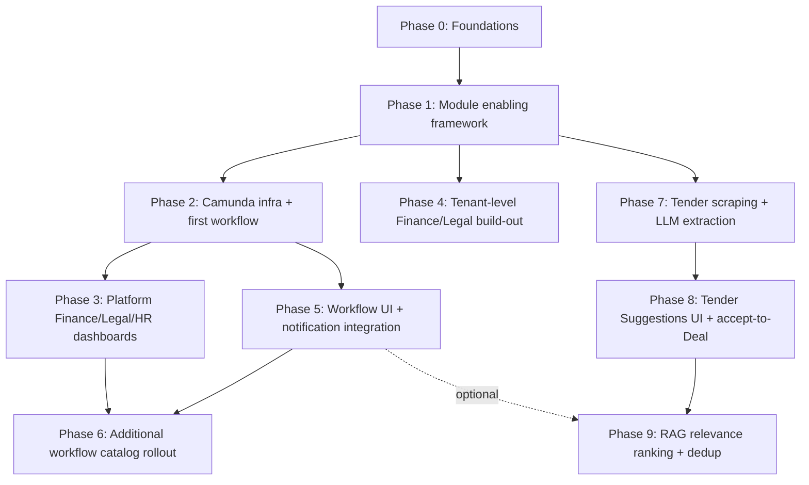

# Platform Layer, Workflow Engine & New Modules — Strategic Development Plan

**Scope:** Turn Orelia CRM from a single-layer multi-tenant CRM into a two-layer platform: regular
tenants underneath, and a **Platform (System) layer** above them that owns cross-tenant shared
services — Finance, Legal, HR — plus a BPMN workflow engine (Camunda) for recruitment/onboarding
and other business processes, on-demand per-tenant module enabling, and the RBAC/Camunda admin UIs
that operate all of it.

This is a strategy + phased roadmap document, not epics/stories — once a phase is approved, run
`bmad-create-epics-and-stories` against the relevant section to produce the trackable backlog, the
same way `epics-hr.md`/`epics-system.md` already exist for other initiatives.

## Grounding: what already exists (don't rebuild this)

The instinct for "super tenant above the multi-tenant" is usually to model it as a separate
entity/schema. **Don't** — this codebase already solved that problem, and the existing solution is
sound:

- There is already a real **System tenant**: a normal row in `tenants_registry` at the reserved
  slug `system` (`SYSTEM_TENANT_SLUG`, `common/src/constants/tenant.ts`), resolved via
  `SystemTenantCache.isSystemTenant(tenantId)`. It is not a different kind of entity — it's a
  tenant like any other, which is exactly why platform features can reuse every tenant-scoped
  building block (RBAC roles, users, audit log) instead of forking a parallel stack for "the
  platform side."
- **`RbacResource.isPlatformOnly`** + `PLATFORM_ONLY_PERMISSIONS` (`backend/src/database/seeds/seed.ts`)
  already gate resources so only the System tenant can hold them (`TENANTS_*`,
  `PLATFORM_IMPERSONATE_TENANT`, `BACKUP_CREATE`). Finance/Legal/HR platform-level permissions are
  new entries in this same list, not a new mechanism.
- **"Act as tenant"** (`ACT_AS_TENANT_COOKIE` + `TenantContextInterceptor` + `TenantContextService`,
  AsyncLocalStorage-based) already lets a System-tenant admin operate against another tenant's data
  scope within the same session. This is the primitive a Platform Finance/HR dashboard needs to
  read/aggregate across tenants — extend it, don't replace it.
- **Frontend routing already shares one tree**: there is no separate super-admin route today —
  `system` is just another `[tenant]` slug using the same `(dashboard)` layout, gated by
  `isPlatformOnly` permissions. `admin/tenants` and `admin/roles` already live there. The new
  Platform Finance/Legal/HR/Camunda screens are new pages under that same `admin/` (or a new
  `platform/`) segment — not a second Next.js app, not a second auth system.
- `finance` and `legal` **nav entries and route placeholders already exist** in the tenant-level
  sidebar (`ComingSoonSection`, explicitly commented "no RBAC permission yet"). There are two
  distinct Finance/Legal surfaces to keep straight through this whole plan:
  - **Tenant-level Finance/Legal** (already scaffolded, currently placeholder) — e.g. a tenant's
    own deal costing/invoicing, tenant-specific contracts.
  - **Platform-level Finance/Legal/HR** (net-new) — cross-tenant consolidated views: platform
    revenue across all tenants, shared legal templates/compliance, and (per the HR decision below)
    HR for the organization running Orelia itself. These are genuinely different features that
    happen to share a name with their tenant-level counterparts; don't collapse them into one
    module.

**HR is explicitly two separate surfaces, not one "Platform HR" catch-all** (confirmed):
- **Tenant HR** — already exists today as the `employees`/`certifications` modules, scoped per
  tenant. Each tenant manages its own employees; no cross-tenant visibility.
- **Super-tenant HR** — net-new: HR for the organization running Orelia itself (internal
  headcount, internal recruitment, internal onboarding), living entirely under the System tenant.
  It is not a cross-tenant aggregation of tenant HR data — it's a fully separate employee/org
  dataset that happens to reuse the same entity shapes and modules-pattern as tenant HR, scoped to
  the System tenant like any other platform-only resource.

Because Super-tenant HR reuses the same shape as Tenant HR, the cheapest build is **the same
`employees`/`certifications` modules, scoped to the System tenant** rather than a parallel HR
module — the existing `TenantOwnedEntity` scoping already isolates System-tenant employee records
from every other tenant's, for free. Add `isPlatformOnly` HR permissions distinct from the
tenant-scoped ones so System-tenant HR admins don't automatically gain rights over every tenant's
employee data, and vice versa.
- **Nothing exists yet for**: on-demand module enabling (`enabledModules`/feature flags — zero hits
  anywhere), Camunda/BPMN (no dependency, no service), Redis/queue infra (docker-compose has only
  postgres + backend + frontend). All net-new.

## Architecture decisions this plan makes

1. **No new tenant-like entity.** "Platform" = the existing System tenant + `isPlatformOnly` RBAC,
   extended. This avoids a second scoping mechanism living alongside `TenantOwnedEntity`/
   `BaseTenantRepository`.
2. **Camunda runs as an external engine, not embedded.** Camunda 8 (Zeebe) via Docker, integrated
   over its gRPC/REST client from a new `backend/src/core/workflow/` module (or `modules/workflow-engine/`
   if it grows resource-shaped CRUD of its own — call it during epics breakdown). NestJS stays the
   system of record for CRM data; Camunda stays the system of record for process state
   (in-flight instances, task assignment, timers). The backend calls Camunda to start/advance
   processes and exposes a job worker that Camunda calls back into for service tasks (e.g. "create
   employee record", "send onboarding email").
3. **Module enabling is a new `tenant_module_config` table** (`AuditedTenantEntity`), not a column
   bag on `Tenant`. One row per (tenant, moduleKey) with `enabled: boolean` + `enabledAt`/`enabledBy`
   (audit trail matters here — "who turned Finance on for this tenant and when" is exactly the kind
   of question `audit_logs` exists to answer). A `ModuleGuard` (mirrors `PermissionsGuard`) checks
   this table server-side on every module-scoped route; the frontend also reads it once at layout
   load to hide disabled nav entries, but the guard is the actual enforcement — never trust the
   client list alone, same principle as RBAC.
4. **Camunda UI is a thin custom UI, not Camunda Tasklist/Operate iframed in.** Camunda ships its
   own Tasklist/Operate web apps, but they don't know about this app's tenants, RBAC, or design
   system. Build a minimal in-app "Workflows" section (process instance list, task inbox, a basic
   instance detail/history view) backed by our own controller calling the Zeebe client — this
   keeps auth, tenant scoping, and the design system consistent. Operate can still be run
   separately for engineers/ops to debug process definitions directly; it's not user-facing.
5. **New permission keys follow the existing four-permission model exactly** —
   `FINANCE_VIEW/_CREATE/_UPDATE/_DELETE`, `LEGAL_*`, `HR_*` (platform-scoped versions get
   `isPlatformOnly: true`; tenant-scoped versions don't) plus `WORKFLOW_VIEW/_CREATE/_UPDATE/_DELETE`
   for starting/managing process instances (task-level actions like "complete this task" are
   gated by process-level candidate-group assignment inside Camunda itself, not a new permission
   per task type — don't reinvent Camunda's own authorization primitive).

## Recommended additions beyond what was asked

- **Notifications hookup for workflow tasks.** `modules/notifications` already exists — wire
  Camunda task-created/task-due events into it so "you have a pending onboarding approval" behaves
  like every other in-app notification, instead of requiring users to check a separate Workflows
  tab.
- **A `tenant_module_config` audit view in the existing Activity Log**, not a bespoke one — module
  enable/disable events are exactly what `AuditLogService.record()` + the Activity Log feature
  (`spec-activity-log.md`) already surface; don't build a second history screen.
- **Billing/plan tie-in — deferred by decision.** `Tenant.planId` already exists and *could* gate
  module availability (a Starter plan tenant shouldn't self-enable Finance if that's a paid
  add-on), but for now module enabling is a **pure admin on/off toggle**, no plan-tier check.
  Simpler to build; plan-tier gating can be layered on top of `tenant_module_config` later once
  billing/plans are more fleshed out — the table design (below) doesn't need to change to add it.
- **Platform-level dashboard widgets** reusing the existing `dashboard` module's
  "permission-filtered widgets" pattern (per recent commit `0e64cd3`) rather than a new dashboard
  framework — Platform Finance/HR dashboards should be widgets in that same system, filtered by
  `isPlatformOnly` permissions, not a parallel dashboard implementation.
- **Data residency / cross-tenant read audit.** Any Platform Finance/HR aggregation reads across
  every tenant's data — flag every such read in the endpoint registry as "cross-tenant read" (a new
  column worth adding to `api-endpoint-registry.md`) so it's always visible which endpoints
  intentionally break normal tenant isolation, and can be reviewed as a group later.

## Proposed workflow catalog (Camunda process definitions)

Beyond recruitment and HR onboarding named in the request:

| Process | Trigger | Notes |
|---|---|---|
| Recruitment (req → interview loop → offer) | HR creates requisition | Multi-step approval, candidate-facing steps stay outside Camunda (no portal implied here) |
| Employee onboarding | New Employee record created | Provision accounts, assign training/certifications, manager checklist |
| Employee offboarding | Employment status → Terminated/Resigned | Revoke access, asset return checklist, exit interview task — pairs with the existing "picker excludes inactive" rule so a terminated employee stops appearing as a selectable choice the moment this fires |
| Deal approval (large deal discount/terms) | Deal costing crosses a threshold | Routes to Sales Manager/Finance approval task before deal can move to won stage |
| Tenant onboarding | New Tenant created (Trial/Active) | Provisioning checklist for the Orelia team itself: default roles seeded, welcome email, plan setup |
| Module enable request | Tenant admin requests a paid module | Approval task to Platform admin before `tenant_module_config` flips on, if plan-gating (above) lands |
| Contract/legal review | Legal module document submitted | Review → approve/reject → archive |
| Expense/invoice approval | Finance module submission | Threshold-based approval chain |

This list is a starting proposal — confirm which of these are real near-term needs before building
BPMN definitions for all of them; Camunda process models are cheap to sketch but each one implies
real service-task integration work on our side.

## Phased roadmap

### Phase 0 — Foundations (no user-visible change)
- Add `FINANCE_*`/`LEGAL_*`/`HR_*`/`WORKFLOW_*` permission keys to `permissions.ts` and seed data,
  following the exact four-permission pattern; mark platform variants `isPlatformOnly`. HR keys
  are split tenant-scoped vs. `isPlatformOnly` per the two-surface HR decision above.
- Design + migrate `tenant_module_config` table (`AuditedTenantEntity`), define `ModuleGuard` — no
  plan-tier check (decided: pure admin toggle for now).

### Phase 1 — On-demand module enabling
- Backend: `modules/module-config` (or fold into `tenants` module) — CRUD for
  enable/disable per tenant, wired through `AuditLogService`.
- Frontend: admin screen (System-tenant only) to toggle modules per tenant; tenant-level nav reads
  enabled-module list at layout load to show/hide Finance/Legal/HR/Workflows entries.
- This phase alone unblocks "new finance module" / "legal module" / "some other modules a company
  wants" as configurable rather than hardcoded — subsequent modules plug into this framework
  instead of each needing their own enablement mechanism.

### Phase 2 — Camunda infrastructure
- **Decided: self-managed** (Docker, alongside postgres/backend/frontend in `docker-compose.yml`),
  not Camunda SaaS — fits the existing all-Docker infra with no new subscription, at the cost of
  owning upgrades/scaling/ops ourselves.
- Add Camunda 8 (Zeebe + Operate) to `docker-compose.yml` as new services.
- New backend module wrapping the Zeebe client: start-instance, list-instances,
  complete-task, and a job-worker registration point for service tasks.
- Ship exactly one real process end-to-end (recommend: **Employee onboarding**, since
  `employees`/`certifications` modules already exist to hang service tasks off of) to prove the
  integration before building the catalog.

### Phase 3 — Platform Finance/Legal/HR dashboards
- Cross-tenant read endpoints (flagged per the "data residency" note above), permission-gated,
  built as dashboard widgets in the existing widget framework, for **Finance** (platform
  revenue/ARR rollups) and **Legal** (shared contract templates, compliance tracking).
- **Super-tenant HR** is scoped differently from Finance/Legal in this phase: it is not a
  cross-tenant read at all (see the HR decision above) — it's the `employees`/`certifications`
  modules pointed at the System tenant's own data, so it can be built as soon as the
  `isPlatformOnly` HR permissions from Phase 0 exist, without waiting on the cross-tenant-read
  plumbing Finance/Legal need. Consider pulling Super-tenant HR earlier if the chief architect
  wants HR sooner than Finance/Legal.

### Phase 4 — Tenant-level Finance/Legal build-out (parallel to Phase 3, lower priority)
- Turn the existing `finance`/`legal` "Coming Soon" tenant-level pages into real features,
  RBAC-gated with the new tenant-scoped `FINANCE_*`/`LEGAL_*` keys, module-gated via Phase 1.

### Phase 5 — Workflow UI + notification integration
- In-app Workflows section: my tasks, process instance list/detail, start-new-instance actions
  gated by `WORKFLOW_CREATE`.
- Wire task lifecycle events into `modules/notifications`.

### Phase 6 — Additional workflow catalog rollout
- Recruitment, offboarding, deal approval, tenant onboarding, module-enable-request, contract
  review, expense approval — prioritized and sequenced together once Phase 2's pattern is proven,
  each as its own small epic (process model + service tasks + any new UI).

## New requirement: automated tender discovery & suggestion engine

Two Sri Lankan tender publication sites need to be traversed daily; new tenders found there should
be surfaced to users as suggestions inside the CRM, and on acceptance turned into a real record
(Deal, or a dedicated Tender entity — see the modeling decision below) — not auto-created silently.
This is a distinct capability from the platform/Camunda work above, but slots into the same
framework: it's a good candidate for on-demand module enabling (Phase 1), and its accept action
reuses the audit-log and RBAC patterns already established.

### Modeling decision: staging table, never write directly into `deals`

A scraped tender is unverified external data — it must never land directly in the `deals` table.
Introduce a new **staging entity**, `scraped_tender` (`AuditedTenantEntity` — tenant-scoped since
which tenant a scraped tender is relevant to may itself be a targeting decision, see below), with:

- `sourceSite` (enum: the two configured sites), `sourceUrl`, `externalRef` (the tender's own
  reference number, when the site publishes one — the primary dedup key)
- `rawContent` (the scraped HTML/PDF text, kept for audit/debugging and re-extraction if the
  parsing logic improves later)
- `extracted` (jsonb — normalized fields: title, procuring entity, closing date, estimated value,
  category, description — see extraction approach below)
- `status`: `New | Accepted | Rejected | Ignored`
- `dealId` (nullable FK, set only once `Accepted` creates the real Deal)
- `reviewedBy`/`reviewedAt` (who accepted/rejected it — beyond the base `createdBy`/`updatedBy`,
  since "who scraped this" and "who reviewed it" are different actors and both matter here)

This mirrors the "no silent cascading action" principle already in this codebase's cascade-delete
rule — a scraped tender is a *proposal*, and only an explicit user Accept turns it into a real Deal,
exactly the way the request describes ("users can accept them from UI... then accept them").

### Phase 7 — Scraping + extraction pipeline

- **Site-specific scraper adapters**, one per site (a `TenderSourceAdapter` interface —
  `listNewTenders()` + `fetchDetail(ref)` — implemented per site, not one generic scraper, since
  the two sites will almost certainly differ in HTML structure/pagination/whether documents are
  PDF or HTML). New dependency needed: a headless-browser/HTML-parsing library (e.g. Playwright
  for JS-rendered listings, or Cheerio if the sites are server-rendered — pick per site once their
  actual structure is confirmed, see open question below).
- **Scheduled job**: a new `@Cron` job (the `cron` package is already a backend dependency) running
  daily, iterating both adapters, diffing against `scraped_tender.externalRef` already on file to
  skip tenders already ingested, and inserting new rows with `status = New`.
- **LLM extraction step** — this is the concrete "use an LLM" fit for this requirement: tender
  notices are semi-structured at best (free-text scope of work, inconsistent date formats, values
  buried in prose, sometimes only available as a scanned/text PDF). Rather than writing brittle
  per-field regex/CSS-selector parsing, send each tender's raw content through an LLM extraction
  call (a structured-output/tool-call style prompt, e.g. via the Claude API — see the `claude-api`
  skill for current model/token guidance when this phase is built) that returns the `extracted`
  jsonb shape above. Keep `rawContent` stored regardless, so a bad extraction can be redone later
  without re-scraping.
- Every scrape run and every extraction failure gets a debug-log trail per this project's existing
  "deep debug logging inside every backend endpoint" standard (entry, branch taken, row count out,
  try/catch-log-rethrow) — this is exactly the kind of background job where "why did last night's
  run only find 2 tenders" needs to be answerable from the terminal, not a debugger.

### Phase 8 — Tender Suggestions UI + accept-to-Deal

- New frontend page, **Tender Suggestions** (tenant-level, module-gated via Phase 1's framework so
  a tenant can opt out entirely) — a review inbox listing `status = New` rows: extracted title,
  procuring entity, closing date, estimated value, a link to `sourceUrl`, and Accept/Reject/Ignore
  actions. A badge/count in the sidebar nav, following the same "surface work waiting on a user"
  pattern as the Workflow task inbox in Phase 5.
- **Accept** opens the existing `AddDealDialog` pre-filled from `extracted` (reusing the dialog
  users already know, not a new create-deal form) rather than silently auto-creating the Deal —
  keeping a human in the loop on every field before it becomes a real Deal, and letting them fix
  anything the LLM extraction got wrong. On save, sets `scraped_tender.dealId`/`status = Accepted`/
  `reviewedBy`/`reviewedAt`, and writes the acceptance to `audit_logs` like every other mutation in
  this codebase.
- **Reject/Ignore** are lightweight status-only updates (no cascade, nothing else to clean up) —
  still audit-logged, so "why didn't we bid on this one" stays answerable later.
- New permissions: `TENDER_SUGGESTIONS_VIEW`/`_UPDATE` (review/accept/reject) following the
  four-permission model; no separate `_CREATE`/`_DELETE` needed since rows are created only by the
  scrape job (a system actor, not a user action) and never user-deleted (Reject/Ignore is the
  terminal state, not a delete) — this is the same kind of narrower, justified exception already
  precedented by `AUDIT_LOG_VIEW` in the Permission Model section of `CLAUDE.md`.

### Phase 9 — RAG-based relevance ranking + smarter dedup (optional enhancement, not MVP-blocking)

Two genuine RAG/LLM fits beyond the Phase 7 extraction step, both optional refinements once Phase
7/8 are proven:

- **Relevance ranking.** Not every scraped tender is worth a user's attention — embed each new
  tender's extracted description and compare (vector similarity) against embeddings of this
  tenant's own past won Deals, to surface a "relevance score" or auto-sort the Suggestions inbox by
  fit instead of just scrape date. This is the RAG fit: retrieval over the tenant's own deal
  history, not a generic knowledge base.
- **Smarter deduplication.** `externalRef` handles the easy case (same site republishes the same
  ref), but the two sites may both list the *same real-world tender* under different ref formats,
  or a site may re-list a tender with edits. Embedding-similarity comparison between new and
  recently-ingested tenders' extracted text catches near-duplicates that a plain string match on
  `externalRef` would miss — flag likely duplicates in the UI rather than silently merging them,
  since a wrong auto-merge is worse than an extra row a user dismisses.

Both require a vector store — nothing in the current stack provides one (postgres has no `pgvector`
extension installed yet per the docker-compose scan; this would be a new addition, most simply as
a `pgvector` extension on the existing Postgres 16 instance rather than a wholly separate vector
DB service, given the current all-in-one-Postgres infra pattern).

## Decisions made

| Question | Decision |
|---|---|
| Module enabling: plan-tier gated, or pure admin toggle? | **Pure admin on/off toggle** for now; plan-tier gating deferred, doesn't require a schema change to add later |
| Camunda hosting: self-managed vs. SaaS | **Self-managed** via Docker, added to the existing `docker-compose.yml` |
| Platform HR scope | **Two separate surfaces**: Tenant HR (existing, per-tenant `employees`/`certifications`) and Super-tenant HR (net-new, System-tenant-scoped, same modules reused rather than a parallel build) |

## Open for the chief architect

**Workflow catalog priority (Phase 6).** The proposed table above lists 8 candidate processes
(recruitment, onboarding, offboarding, deal approval, tenant onboarding, module-enable-request,
contract review, expense approval) as a starting menu, not a commitment. Phase 2 only needs one to
prove the Camunda integration end-to-end — **Employee onboarding** is recommended there since
`employees`/`certifications` already exist to hang its service tasks on — but the order everything
else gets built in in Phase 6 is a business-priority call, not an engineering one, and is left for
the chief architect to set once this plan is reviewed.

**Tender site specifics (Phase 7 blocker).** The two Sri Lankan tender sites weren't named in the
request. Before Phase 7 scraper adapters can be built, need per-site: the URLs, whether listings
are plain server-rendered HTML (Cheerio-level scraping) or JS-rendered (needs Playwright/headless
Chrome), whether tender detail is HTML text or scanned/text PDF documents (changes how much the
LLM-extraction step in Phase 7 has to do), whether either requires a login/account to view tender
detail, and each site's robots.txt/terms of use around automated access — daily polling of a public
government tender portal is generally the kind of routine, low-frequency, publicly-published-data
access that's unproblematic, but it's worth a quick check per site before building against it,
same diligence as checking a third-party API's rate limits before integrating.

Once the catalog priority and tender-site specifics are set, run `bmad-create-epics-and-stories`
per phase to produce the trackable backlog (mirroring `epics-hr.md`/`epics-system.md`), starting
with Phase 0/1 since everything else depends on the module-enabling framework existing first.
