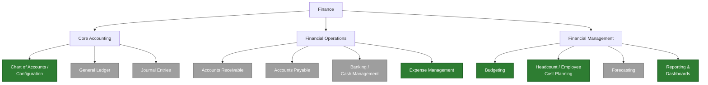
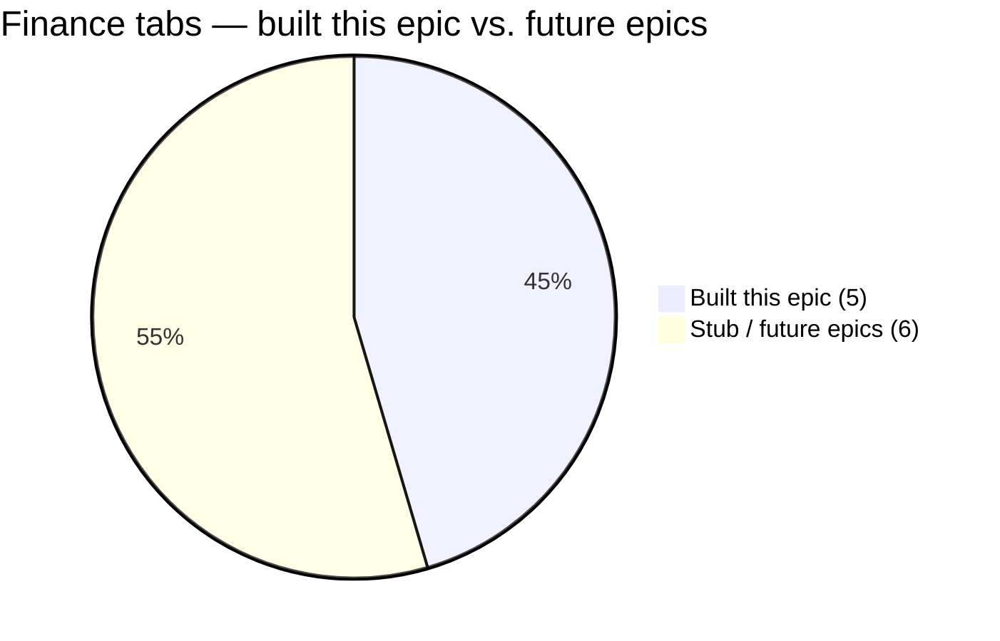
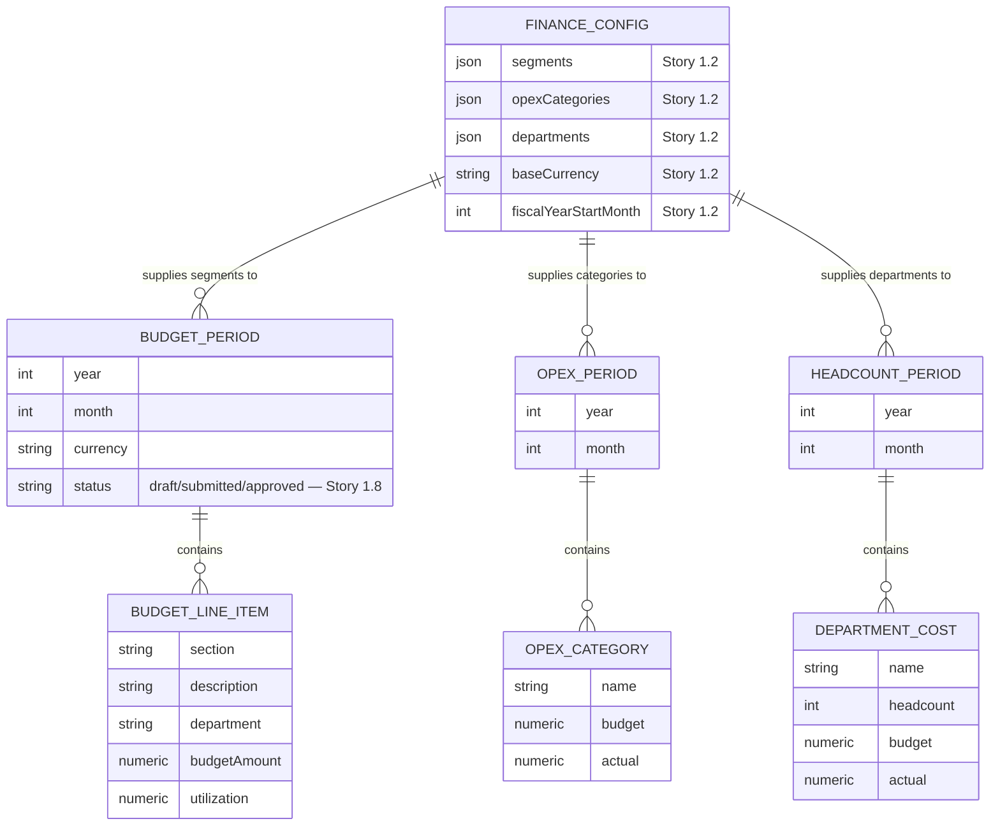
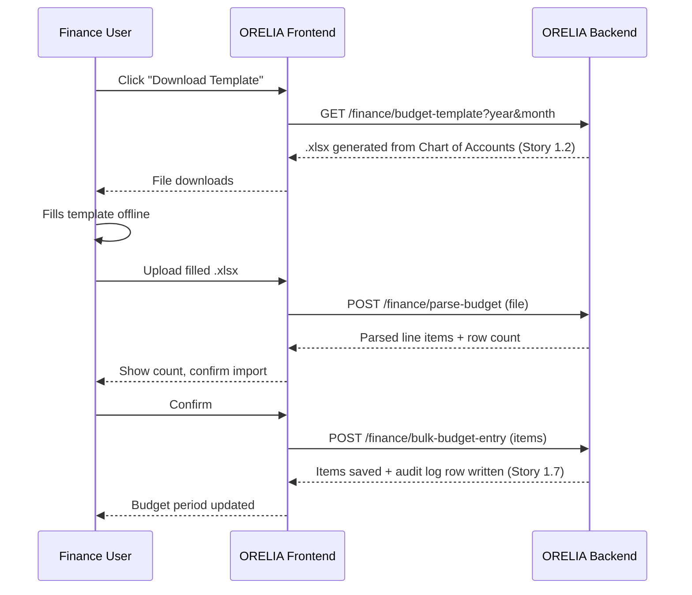
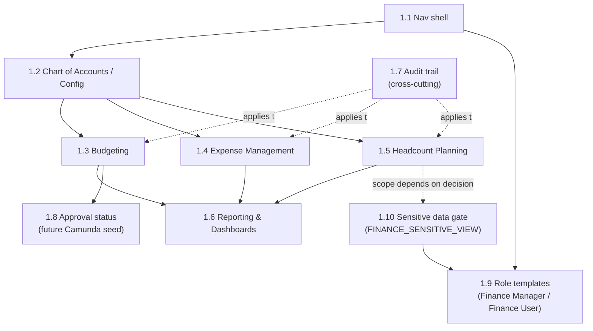
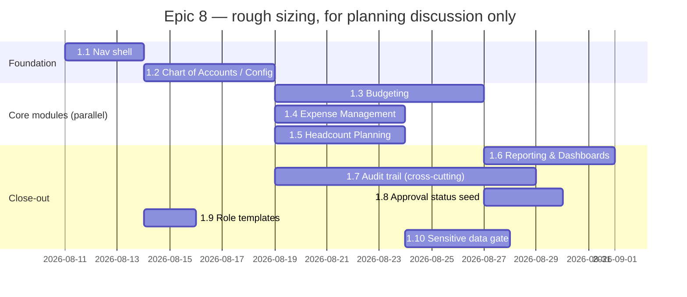

# Epic 8: Finance — Navigation Shell, Configuration & Financial Management (backlog — 0/10)

Part of the split epics tracker — see [`../EPICS.md`](../EPICS.md) for the status-source note and
the "Unsorted / Current Focus" cross-cutting items shared across every file in this folder.

## Origin

Ported from an older internal project (`Hisham-Project`), which had a working, in-production
Finance section covering Monthly Budgets, Operating Expenses, and Employee-Related cost tracking
(~1,200 LOC, one contiguous block in a legacy monolithic `index.html`). That module proved the
workflows are genuinely useful, but its taxonomy (budget segments, OpEx categories, department
lists) was hardcoded per-deployment rather than configurable, and two different department lists
had already drifted out of sync with each other. This epic rebuilds that functionality on ORELIA's
stack (NestJS + Next.js/FlyonUI, permission model, audit trail, i18n) as the first slice of a much
larger finance domain — see "Explicitly out of scope" below for the rest of that domain map.

## Diagram — the full finance domain, and what this epic actually builds



🟢 **green = built this epic** (5 tabs) · ⚪ **grey = stub placeholder, future epic** (6 tabs)



## Sidebar structure this epic establishes

```
Finance
├── Core Accounting
│   ├── Chart of Accounts / Configuration   (built this epic)
│   ├── General Ledger                      (stub only — future epic)
│   └── Journal Entries                     (stub only — future epic)
├── Financial Operations
│   ├── Accounts Receivable                 (stub only — future epic)
│   ├── Accounts Payable                    (stub only — future epic)
│   ├── Banking / Cash Management           (stub only — future epic)
│   └── Expense Management                  (built this epic — old system's "Operating Expenses")
└── Financial Management
    ├── Budgeting                           (built this epic — old system's "Monthly Budgets")
    ├── Headcount / Employee Cost Planning  (built this epic — old system's "Employee Related")
    ├── Forecasting                         (stub only — future epic)
    └── Reporting & Dashboards              (built this epic — old system's 5 chart views)
```

Every stub tab renders a permission-gated "Coming soon" placeholder rather than a 404, so the full
three-group structure is visible and navigable from day one even though most tabs aren't built yet.

## Diagram — data model this epic introduces

Mirrors the old system's proven "period + children" shape (a period row owns many child rows —
line items / categories / department costs), now all reading their taxonomy from one config
instead of three drifting hardcoded lists:



## Stories

- [ ] 1.1 Finance sidebar & navigation shell — the three top-level groups above, each with its
  sub-tabs; unbuilt tabs show the placeholder; gated behind a new resource permission (see open
  question below) instead of the old system's "any logged-in user."
- [ ] 1.2 Chart of Accounts / Configuration (Core Accounting) — tenant-editable list of budget
  segments, OpEx categories, department list, base currency, fiscal-year-start month. Replaces the
  old system's hardcoded `FM_MASTER_SEGMENTS` array, fixed `opex_category` enum, and its two
  conflicting department lists with one admin-editable source of truth. Everything else in this
  epic reads from this config instead of hardcoding its own list.
- [ ] 1.3 Budgeting — Monthly Budget Planning (Financial Management) — line-item budget entry per
  year/month period: section, description, department, category, budget category, expense
  category, qty, unit price, budget amount, utilization, note. Inline add/edit/delete. Excel
  "download template → fill offline → upload → parse → bulk-import" round-trip, template generated
  from 1.2's config instead of a fixed 13-row list (see sequence diagram below).
- [ ] 1.4 Expense Management — Operating Expense Tracking (Financial Operations) — budget-vs-actual
  tracking per category per period, live utilization % (color-coded thresholds), categories sourced
  from 1.2.
- [ ] 1.5 Headcount / Employee Cost Planning (Financial Management) — department-level
  headcount/budget/actual tracking per period with variance %, departments addable/removable
  per period same as the old system.
- [ ] 1.6 Finance Reporting & Dashboards (Financial Management) — the old system's 5 chart views
  (Overview, Monthly Budget, OpEx Budget-vs-Actual, OpEx Month Trend, OpEx Category Trend), rebuilt
  per the `dataviz` skill's conventions rather than the old system's custom canvas drawing code.
- [ ] 1.7 Audit trail on every Finance write — Budget/OpEx/Headcount period create/update/delete
  goes through `AuditLogService.record()` per the standard audit rule in `CLAUDE.md`; every table
  extends `AuditedTenantEntity`. The old system had no audit trail on any finance write at all.
- [ ] 1.8 Lightweight approval status on Budget periods — add a `draft / submitted / approved`
  status + actor + timestamp to budget periods. **Deliberately not a real workflow engine** — this
  is the seed field that a future story wires up to the Camunda-based approval engine from
  [`../plan-camunda-approval-workflows.md`](../plan-camunda-approval-workflows.md) once that
  prototype (currently scoped for Deal approval) proves out.
- [ ] 1.9 Pre-built Finance role templates — two starter roles seeded through ORELIA's existing
  Roles admin section (not a new "template" mechanism): **Finance Manager** (all
  `FINANCE_VIEW/_CREATE/_UPDATE/_DELETE`, plus `FINANCE_SENSITIVE_VIEW` from 1.10) and
  **Finance User** (`FINANCE_VIEW` + `FINANCE_CREATE`, no `_DELETE`, no sensitive access). These
  are ordinary Role rows — a tenant admin can edit or clone them afterward exactly like any other
  role; nothing about them is hardcoded or special-cased.
- [ ] 1.10 Sensitive Finance data visibility — an additive `FINANCE_SENSITIVE_VIEW` permission
  (same shape as the existing single-permission `AUDIT_LOG_VIEW` exception in `CLAUDE.md` — not a
  `_MANAGE` wildcard, and not a replacement for the base four) so specific finance data stays
  hidden from users who hold base `FINANCE_VIEW` but aren't cleared for it. Exact scope — which
  data counts as sensitive, and whether it's hidden per-module, per-field, or per-tenant-configured
  — is an open decision, see below.

## Diagram — Excel round-trip (Story 1.3, ported from the old system)



## Diagram — business flow, this epic vs. the future state

What actually happens to a budget line item today (Story 1.8's flat status field, no routing
logic):


What it becomes once the Camunda approval-engine prototype proves out (from
[`../plan-camunda-approval-workflows.md`](../plan-camunda-approval-workflows.md)) and Core
Accounting exists — **neither of these is part of this epic**, shown only to make clear where 1.8
plugs in later:


## Diagram — story sequencing



## Chart — rough phasing (illustrative sizing only — not committed dates)



## Decision — permission grain (resolved)

**One shared `FINANCE_VIEW/_CREATE/_UPDATE/_DELETE` permission set for the whole section**, not a
separate four-permission set per module. Matches the old system's single-module feel and avoids
over-splitting before real usage shows a need; revisit once Core Accounting / Financial Operations
modules land and clearly are separate resources.

On top of that base four, access is meant to be handed out via **pre-built role templates**
(Story 1.9 — Finance Manager / Finance User, ordinary editable Role rows, not a special mechanism)
rather than by assigning raw permissions directly, and a **sensitive-data gate** (Story 1.10 —
`FINANCE_SENSITIVE_VIEW`, additive, same shape as the existing `AUDIT_LOG_VIEW` exception) so
Finance User-tier access doesn't automatically expose everything a Finance Manager can see.

## Open question (needs a decision before 1.10 starts)

What "sensitive" means in scope/granularity terms — the three real options:

1. **Whole-module gate** — e.g. Headcount / Employee Cost Planning (salary-adjacent) requires
   `FINANCE_SENSITIVE_VIEW`; Budgeting and Expense Management don't. Simplest to build and reason
   about, matches this epic's "don't over-build for hypothetical need" instinct elsewhere.
2. **Field-level masking within any module** — e.g. an "Actual" cost column renders as `•••` for
   users without the sensitive permission, but the row/structure stays visible. More flexible, more
   UI work (every table needs a masked-cell variant), and needs a rule for which columns count.
3. **Per-tenant configurable marking** — extend the Chart of Accounts / Configuration (Story 1.2)
   so each company itself marks which segments/categories/departments count as sensitive. Most
   consistent with this epic's overall "customizable per company" theme, but meaningfully more
   scope for a first pass — likely worth deferring to a follow-up story once 1.2's config layer
   exists and real usage shows which fields companies actually want to restrict.

## Explicitly out of scope for this epic (future epics, no old-system equivalent)

- **General Ledger + Journal Entries** (Core Accounting) — real double-entry posting engine. Every
  other finance module eventually posts into this; sequencing it after Budgeting/Expense Management
  are proven live, not before.
- **Accounts Receivable / Accounts Payable / Banking** (Financial Operations) — net-new subledgers;
  AR later connects to Deals (Won deal → Customer Invoice) once it exists.
- **Forecasting** (Financial Management) — net-new, no old-system equivalent.
- **Full configurable approval workflows** — tracked entirely in
  [`../plan-camunda-approval-workflows.md`](../plan-camunda-approval-workflows.md), which is still
  pending Phase 0/1 sign-off for its first use case (Deal approval). Story 1.8 above is intentionally
  the minimum placeholder, not a parallel workflow system.
