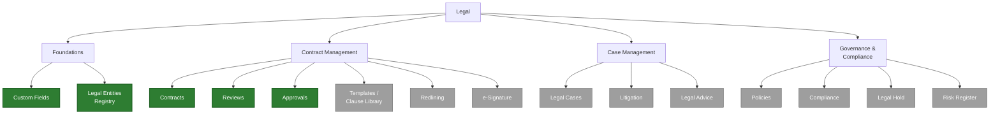
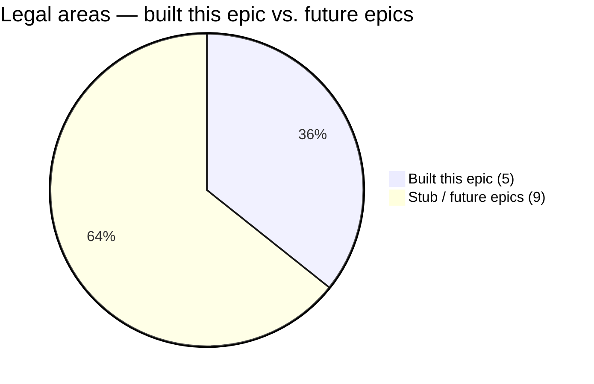
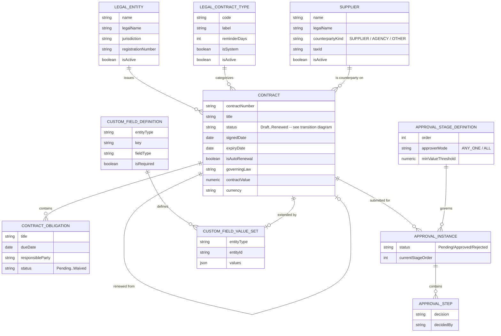
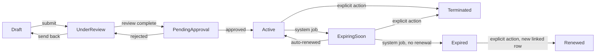
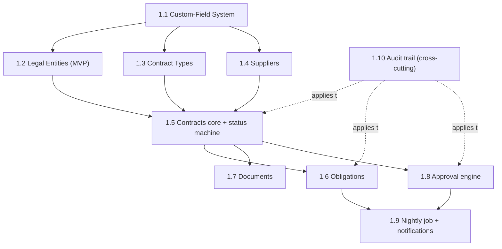
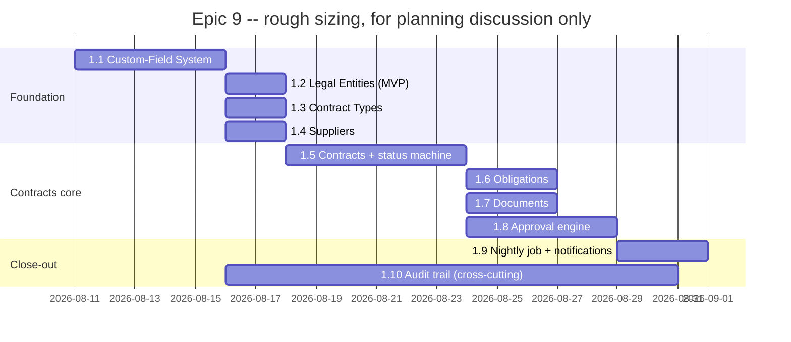

# Epic 9: Legal — Contract Management & Configurable Foundations (backlog — 0/10)

Part of the split epics tracker — see [`../EPICS.md`](../EPICS.md) for the status-source note and
the "Unsorted / Current Focus" cross-cutting items shared across every file in this folder.

## Origin

Ported from an older internal project (`Hisham-Project`), which had a working, in-production
"Legal Management" module covering Contracts, Suppliers, Agencies, Contract Types, and an "OREL
Companies" issuing-entity concept, backed by raw SQL against Postgres inside a legacy monolithic
`index.html`. That module proved the workflow is genuinely useful — but its tenant isolation was
retrofitted after a real cross-tenant IDOR vulnerability shipped (fixed, then a second hardening
pass was needed because some writes still left `tenant_id` null), its `status` column was
unvalidated free text a `PUT` could set to anything, and it modeled an `alerts`/obligation system
that nothing ever actually processed — no notification was ever sent. This epic rebuilds that
functionality on ORELIA's stack (NestJS + Next.js/FlyonUI, tenant-scoped base entities, permission
model, audit trail, i18n), fixes each of those three gaps directly, and adds something the old
system never had: a genuine per-tenant custom-field system, so any client can extend the schema
themselves without an engineering change per client — the first slice of a much larger legal-ops
domain, see "Explicitly out of scope" below for the rest of that domain map.

## Diagram — the full legal domain, and what this epic actually builds



🟢 **green = built this epic** (5 areas) · ⚪ **grey = stub placeholder, future epic** (9 areas)



## Sidebar structure this epic establishes

```
Legal
├── Contracts                              (built this epic)
├── Suppliers                              (built this epic)
├── Legal Cases                            (stub only — future epic, Case Management)
├── Governance & Compliance                (stub only — future epic)
│   ├── Policies                           (stub only — future epic)
│   ├── Compliance & Legal Hold            (stub only — future epic)
│   └── Risk Register                      (stub only — future epic)
└── Settings (admin)
    ├── Contract Types                     (built this epic)
    ├── Legal Entities                     (built this epic)
    ├── Approval Stages                    (built this epic)
    └── Custom Fields                      (built this epic)
```

Every stub area renders a permission-gated "Coming soon" placeholder rather than a 404, so the full
domain structure is visible and navigable from day one even though most of it isn't built yet.

## Diagram — data model this epic introduces

`CustomFieldDefinition`/`CustomFieldValueSet` are generic and `entityType`-keyed (not Legal-only —
future modules append their own entity types). The existing polymorphic `documents` table is
reused wholesale for contract documents and is not redrawn here.



## Diagram — Contract status transitions

The concrete fix for the old system's free-text status gap (`PUT` could set the column to
anything): "Reviews" and "Approvals" are real, distinct stages here, not one flat column.



Any transition not shown above must be rejected with a 400 naming the disallowed `from -> to`
pair, enforced in one dedicated `updateStatus()` method — `status` is otherwise excluded from the
general-purpose Contract update DTO.

## Stories

- [ ] 1.1 Custom-Field System foundation — a typed `CustomFieldDefinition` registry table plus one
  JSONB value-bag per record (`CustomFieldValueSet`, one row per entity instance), keyed by a
  generic `entityType` enum so any future module can append its own entity types, not just Legal.
  `CustomFieldValuesService.replaceValues()` follows the validate-then-transaction pattern
  `deals.service.ts::validateReferences` and `relationship-parties.service.ts::validateIndustryIds`
  already establish: load active definitions, reject unknown keys naming them, per-field type/
  required/option validation, batch-resolve `reference`-type fields through an explicit resolver
  map, then one transaction that upserts the value-set row (`ON CONFLICT` on a unique index) plus
  an `AuditLogService.record()` diff. Frontend: one reusable `<CustomFieldsPanel/>`, mounted as a
  fixed-height tab in every later Legal entity's form dialog. Everything else in this epic depends
  on this landing first.
- [ ] 1.2 Legal Entities registry (MVP) — thin subsidiary list (name, legal name, jurisdiction +
  custom override, registration number, active flag), Departments-pattern CRUD. Deliberately
  minimal; upgraded into a full corporate registry (officers, parent/subsidiary tree) in a later,
  not-yet-numbered epic — see "Explicitly out of scope."
- [ ] 1.3 Contract Types (config) — code/label/description/number-prefix/reminder-days,
  `isSystem`-protected seeded defaults, tenant-addable custom types. Departments pattern.
- [ ] 1.4 Suppliers — a single `Supplier` entity with a `counterpartyKind` enum
  (`SUPPLIER`/`AGENCY`/`OTHER`) covering what the old system split into two near-identical tables
  (Suppliers and Agencies) with no actual behavioral difference ever identified between them.
- [ ] 1.5 Contracts — core CRUD plus the validated status transition table above. Auto-generated
  `contractNumber` (`PREFIX-TYPE-YEAR-NNN`) using the same collision-retry pattern as
  `Deal.dealCode` in `deals.service.ts::create`. Counterparty is `companyId?`/`contactId?`/
  `supplierId?` (mutually exclusive, mirroring `Deal`) plus a manual-override text field. This is
  the direct regression fix for the old system's unvalidated `status` column.
- [ ] 1.6 Contract Obligations — a real child table (not a custom field, since it needs its own
  status lifecycle and due-date-driven notification): title/description/due date/responsible
  party/status (Pending→DueSoon→Overdue→Completed/Waived). "Replace the set" on edit follows the
  same validate-then-transaction pattern as `relationship-parties.service.ts::updateCompany`'s
  industry-link diff.
- [ ] 1.7 Contract Documents — zero new upload plumbing: reuse the existing polymorphic
  `documents` table and `S3Service` wholesale, adding only a new owner type and S3 key-prefix
  constant. `LegalContractDocumentsService` as a direct sibling of `deal-documents.service.ts`.
- [ ] 1.8 Approval Stage engine (MVP) — a tenant configures an ordered list of approval stages per
  contract type (or "all types"); each stage names one or more approvers (`ANY_ONE`/`ALL`), with
  one optional value-threshold condition per stage. Deliberately **not** a BPMN engine: no
  branching, no arbitrary conditions, no timer escalation — see "The Camunda question" below for
  why, and for the swap-seam (`LegalApprovalGateService.getStatus()`) that lets a future Camunda
  integration replace this without touching the `Contract` entity or its status machine.
- [ ] 1.9 Nightly status-recompute job + real notifications — `LegalStatusRecomputeJob` (`@Cron`,
  same pattern as `fx-rates.service.ts`), per-tenant scoped, daily: recomputes contract/obligation
  status transitions (writing one audit-log row per transition) and calls two new `MailService`
  methods (`sendContractExpiringSoonEmail`, `sendObligationOverdueEmail`). This is the concrete fix
  for the old system's dead `alerts`/obligation model, which was stored but never actually
  processed or delivered to anyone.
- [ ] 1.10 Audit trail on every Legal write — every new table extends `AuditedTenantEntity` from
  its first commit and every create/update/delete calls `AuditLogService.record()`, per the
  standard audit rule in `CLAUDE.md`. The old system had no audit trail on any legal write at all,
  and its tenant scoping specifically was retrofitted only after a real IDOR vulnerability shipped
  — this story (and the base-class choice throughout the epic) is what makes that gap structurally
  unreachable here instead of something to remember to add later.

## The Camunda question (design note under Story 1.8)

Story 1.8 ships its own small, self-contained approval-stage config rather than waiting on or
duplicating [`../plan-camunda-approval-workflows.md`](../plan-camunda-approval-workflows.md) — a
separate, already-pending proposal (blocked on unconfirmed licensing, not yet past its own Phase
0/1) for a general configurable approval engine, whose own roadmap only reaches "reuse for
contracts" at **Phase 5**, gated behind four earlier phases of an unrelated initiative. Blocking
Legal's approval gate on that chain would make this epic hostage to a different initiative's
unresolved licensing question.

`ContractsService` never touches approval tables directly — it only ever asks
`LegalApprovalGateService.getStatus(contractId)`. When/if the Camunda initiative reaches its own
Phase 5, a tenant can opt into a Zeebe-backed implementation of that same interface with zero
change to the `Contract` entity, its status machine, or any screen. The engine is designed
generically (keyed by `entityType`, not hardcoded to Contracts) so a future Case Management epic
can reuse Story 1.8's own tables directly instead of needing a second bespoke engine.

## Diagram — story sequencing



## Chart — rough phasing (illustrative sizing only — not committed dates)



## Open questions (need a decision before 1.5 / before 1.1, respectively)

1. **Permission grain.** Whether Legal gets one shared `LEGAL_VIEW/_CREATE/_UPDATE/_DELETE` for the
   whole section, or each entity (Contracts, Suppliers, Contract Types, Legal Entities, Approval
   Stages, Custom Fields) gets its own four-permission set as a separate resource. The four-
   permission rule in `CLAUDE.md` applies either way — this is only about grain size. Leaning
   toward **per-entity** here (unlike Finance's Epic 8, which leaned toward one shared set for its
   first epic) because Legal's entities read as more clearly separate resources with different
   natural owners (a contract admin vs. a suppliers-list maintainer) even at this first epic —
   revisit if that turns out to be over-splitting in practice.
2. **Where `CustomFieldEntityType` lives.** Ship it as a shared `common/src/enums/` file from
   Story 1.1 onward (so non-Legal modules can append their own entity types later without touching
   Legal's code), or start it Legal-scoped and promote later. Leaning toward shared from day one —
   the cost of doing so now is zero, and it avoids a rename/move migration later.

## Explicitly out of scope for this epic (future epics, no old-system equivalent)

- **Case Management** (Legal Cases, Litigation, Legal Advice) — net-new, no old-system equivalent.
  Reuses Story 1.8's approval-stage engine directly once built, rather than a second engine.
  Intake/assignment/SLA cycle-time tracking is a genuinely new concept for this codebase (Deal-
  stage funnels don't map onto queue/backlog semantics) — needs its own design pass. "Legal
  Advice" specifically needs a decision on whether it's a lightweight case subtype or its own
  minimal entity, deferred to when this is picked up.
- **Governance & Compliance** (Policies, Compliance, Risk, plus Legal Hold) — net-new. Industry
  research flags this pillar as the majority of real legal-ops workload, so despite being out of
  scope for *this* epic it should be prioritized, not treated as an afterthought, once room exists.
  **Legal Hold** specifically needs its own dedicated design pass before any build — it must
  suppress normal soft-delete/retention behavior on whatever it's placed over, app-wide, not just
  within Legal, which cuts across every other module's existing delete logic. **Policy Management**
  needs a decision on whether policy versioning reuses a lightweight version of the future
  Contracts-Advanced template system or needs its own entity. **Risk Register** likelihood/impact
  scoring is a good candidate for the custom-field system rather than bespoke columns — confirm
  that fits before assuming otherwise.
- **Entity Management (full registry)** — officers, parent/subsidiary relationships with cycle
  prevention, upgrading Story 1.2's thin MVP. Self-referential trees with cycle guards aren't
  modeled anywhere else in ORELIA yet (Departments/Teams are flat) — needs its own design pass.
  Used by all three pillars once it exists (issuing entity on Contracts, entity scope on Cases,
  jurisdiction scope on Compliance), so it's worth prioritizing once more than one pillar needs it.
- **Legal Spend Management** — outside-counsel spend vs. budget, keyed off Suppliers (Story 1.4)
  and optionally Contracts or future Legal Cases — a reporting/aggregation layer over the other
  pillars, not a pillar itself. Needs a decision between an approval-routed invoice-line entity
  (reusing Story 1.8's engine again) vs. a real e-billing integration (LEDES format is the industry
  standard) before designing tables.
- **Contracts Advanced** (template/clause library, redlining, e-signature) — each a substantial,
  largely independent build (document-generation pipeline; real-time collaborative diffing; an
  external e-signature vendor integration with its own auth/webhooks). None block this epic's core
  value — a searchable, status-tracked, obligation-tracked, notification-driven, review-and-
  approval-gated contract repository already covers the majority of what the research lists as
  CLM's function, and document upload (not authoring) is already covered by Story 1.7. Pick this
  up only if a specific client need for in-app authoring/redlining is confirmed.
- **Full Camunda-based approval engine swap** — tracked entirely in
  [`../plan-camunda-approval-workflows.md`](../plan-camunda-approval-workflows.md), still pending
  Phase 0/1 sign-off for its own first use case (Deal approval). Story 1.8 above is intentionally
  the minimum self-contained placeholder, not a parallel workflow system — identical framing to
  Finance Epic 8's own Story 1.8 note.
