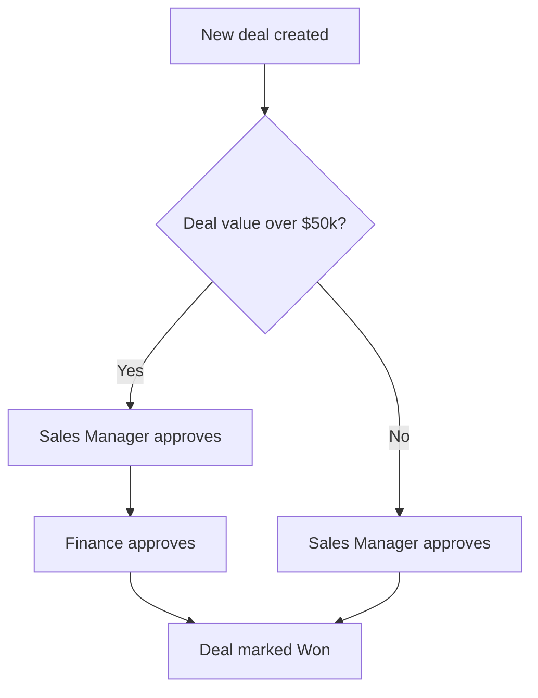
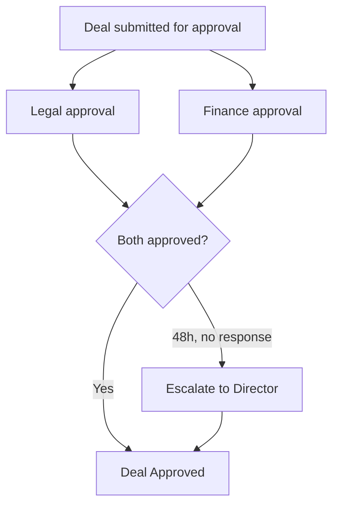
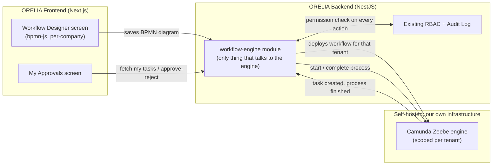
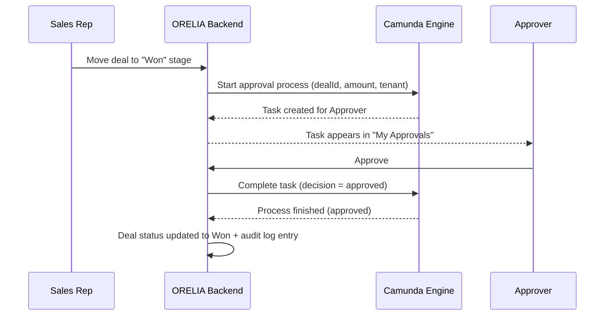

# Proposal: Configurable Per-Company Approval Workflows (Camunda)

*Prepared for supervisor review/approval.*

---

## 1. Summary (Non-Technical)

**What we want to build:** let every company that uses ORELIA define and change its own approval
process — e.g. "which deals need sign-off, from whom, and in what order" — themselves, from
inside the product, without our engineering team hand-coding it per client.

**Why:** every company approves things differently. Today ORELIA can only support one hardcoded
approval behavior for everyone. That's a real limit on how many different companies can actually
adopt ORELIA as their CRM — this feature turns "approval process" into a configuration each
client sets up themselves, which is a meaningful product differentiator, not just an internal
convenience.

**How:** rather than build a custom rules engine from scratch — which risks quietly turning into
a multi-year side project — we adopt Camunda, a mature, widely-used, open-source engine built
specifically for this problem, and run our own private copy of it inside our own infrastructure
(client data never leaves our servers).

**What we're asking for right now:** approval to spend a small amount of time (Phase 0 below)
confirming Camunda can legally be embedded in a product we resell, and to run a throwaway
prototype to validate the approach — **not** approval of the full multi-month build yet. Full
build-out is a separate decision after the prototype proves out.

---

## 2. How It Would Work — Plain-Language Walkthrough

Think of it like giving every client company its own customizable flowchart for "what has to
happen before X counts as approved."

- **Company A** wants: *any deal over $50k needs Sales Manager approval, then Finance approval.*
- **Company B** wants: *every deal needs exactly one approval, no matter the size.*
- **Company C** wants: *deals need Legal AND Finance approval in parallel, and if nobody responds
  within 48 hours it automatically escalates to a director.*

Today ORELIA can't offer any of this — it would have to be hardcoded the same way for every
client. With this change: a company's own admin opens a "Workflow Designer" screen inside
ORELIA, drags boxes onto a canvas to build their approval flow (who approves, in what order,
under what conditions, what happens if nobody responds), and saves it. From then on, ORELIA
automatically walks each deal through that specific company's flow — routing it to the right
person, waiting for their decision, and only moving forward once it's actually approved.

**Example — Company A's flow (simple, conditional):**

**Example — Company C's flow (parallel approval + escalation):**

Every box in these diagrams is something the *company's own admin* draws themselves in the
Workflow Designer — we're not hardcoding either of these, they're just two examples of what
different companies could configure.

---

## 3. What We're Adopting, and Why Not Build It Ourselves

**Camunda** is an open-source workflow/business-process engine used broadly across the industry
for exactly this kind of problem. Two design choices keep it under our own control rather than
becoming "someone else's product bolted onto ours":

- **Self-hosted, not Camunda's cloud service.** We run our own private copy inside our own
  existing hosting environment (we already host Postgres/backend/frontend ourselves). Client
  approval data never leaves our infrastructure. **Note this is more than "one more container"** —
  see §4's infrastructure delta and §6's first risk; the honest version is in §6, and this bullet
  should not be read as contradicting it.
- **Our own screens, not Camunda's.** We build ORELIA's own "Workflow Designer" and "My
  Approvals" screens, styled to match the rest of the product exactly. Camunda's engine runs
  underneath, invisible to the end user — it never feels like a third-party tool was dropped in.

**Why not build our own mini version of this instead?** We looked at that first. It works fine
for simple, single-step approvals — but the actual requirement here is real branching, parallel
approvals, and time-based escalation, which is a genuinely hard problem to get right and keep
reliable. Building and maintaining that ourselves is a bigger, riskier, longer-running commitment
than adopting a tool that already solves it well.

---

## 4. Technical Explanation

**Engine:** Camunda 8 (its "Zeebe" execution engine), self-hosted in our existing Docker-based
deployment alongside the current Postgres/backend/frontend.

**Infrastructure delta — must be enumerated in Phase 0, not estimated from "one more service."**
What exists today (verified 2026-08-06) is exactly four compose services: `postgres`, a one-shot
`setup`, `backend`, `frontend`. **No Redis, no message queue, no Elasticsearch, no worker
container** — and the backend runs as a *single* instance (`core/realtime/realtime.service.ts:8`
depends on that fact). Camunda 8 self-managed is not one container: it is a Zeebe broker plus
gateway, and if Operate/Tasklist are run at all (even just for engineers to debug process
definitions) they require Elasticsearch, which is itself a heavier operational commitment than
anything currently in this stack. Phase 0 must produce the **actual container list and its
memory/disk footprint on the target host**, because the whole cost/ops estimate rests on it.

**Deployment prerequisite — this plan lands on unstable ground today.** Per
[`PLANS.md`](./PLANS.md)'s Production Deployment Hardening plan, as of now: there is exactly **one
environment** (no staging), Postgres runs inside `goldbond-postgres` — *a container belonging to an
unrelated project on the same EC2 host* — the backend runs from `Dockerfile.dev` (`pnpm dev`,
hot-reload) in production, deploys are manual over SSH with no CI/CD and no verified database
backup, and `deploy.sh:17` references a `docker-compose.prod.yml` **that does not exist in the
repository**. Adding a distributed workflow engine on top of that is materially riskier than the
engine itself. **Phase 1 should not start until Production Deployment Hardening's Phase 0/1 has
landed** — that dependency is now part of this plan's Phase 0 checklist below.

**Multi-tenancy:** Zeebe natively supports scoping process definitions and running instances by
tenant ID, and those ids line up 1:1 with ORELIA's own tenant uuids. **The ids match; the
*context* does not — and that gap is real work, not a detail.** Verified against the codebase
2026-08-06:

- ORELIA's tenant scoping is **request-scoped `AsyncLocalStorage`**. `TenantContextService.run()`
  (`backend/src/core/tenant/tenant-context.service.ts:18-20`) has **exactly one call site in the
  entire repository** — the HTTP interceptor (`tenant-context.interceptor.ts:89`), which reads
  `req.user` / the act-as-tenant cookie. `getStore()` throws
  `"TenantContext accessed outside of a request scope"` (`tenant-context.service.ts:24-26`).
- The runtime sequence below has the engine calling *back into* the backend
  (`ZB-->>BE: Process finished`). That is **not** an HTTP request carrying a user JWT. With no
  tenant context established, every `BaseTenantRepository` call on that path throws.
- The audit failure mode is worse than a crash because it is **silent**: `AuditLogService.record()`
  catches the missing context and writes the row as a **platform-level** entry instead of a
  tenant-scoped one (`backend/src/core/audit-log/audit-log.service.ts:110-115`). Engine-initiated
  approvals would quietly land in the wrong scope rather than failing loudly.
- `actorId` is an explicit parameter that is never derived from context
  (`audit-log.service.ts:122`). A timer-based escalation has no human actor — there is no
  system-actor convention in this codebase today.

**Consequence:** a "run as tenant" / system-actor context API must be designed and built **before**
Phase 2, and it is a prerequisite of Phase 2, not a task inside it. It is not Camunda-specific —
Legal Epic 9's Story 1.9 nightly job needs exactly the same capability (see that epic's own note),
so this should be built once, deliberately, as shared infrastructure. Tracked in `EPICS.md`'s
"Unsorted / Current Focus".

**Backend integration:** one new backend module is the *only* thing that talks to the engine.
It: deploys a company's saved workflow to the engine; starts a new approval "instance" when
something needs approving (e.g. a deal moves stage); lists a user's pending approvals — filtered
through our own permission system first, never trusting the engine's own idea of who's allowed
what; and completes an approval (approve/reject) once verified through our own login/permissions.
Every one of those actions gets an audit-log entry, same as everything else in the system today.

**On that "only one module" boundary — achievable, but counter-cultural here, so it has to be an
enforced written rule rather than an assumption.** Direct cross-module repository access is the
current norm in this codebase, not the exception: `relationship-types.module.ts:44-45` re-declares
Companies/Contacts repositories as its own providers; `dashboard-metrics.service.ts:38-42` injects
`Repository<Deal>`/`Repository<Tenant>` raw; `users.module.ts:22-26` explicitly exports
`TypeOrmModule` *so that other modules can bypass `UsersService`*. The closest existing precedent
for a genuine integration boundary — `S3Service`, `MailService`, `FxRatesService` — is enforced
**by comment and discipline, not by an interface** (there is no DI-token or abstract-class seam
anywhere in `backend/src`). Add the rule to `CLAUDE.md` when Phase 2 starts.

**Designer screen:** built using `bpmn-js`, a free, open-source drag-and-drop diagram library
(the same one that powers Camunda's own tools, but usable standalone). We embed it directly in
our own admin page and styling — the client's admin never leaves ORELIA to use it.

**Approval screen:** a normal ORELIA screen (matching existing components/design), not Camunda's
own UI — shows "My Approvals," lets a user approve/reject, pulled from our backend which talks
to the engine behind the scenes.

**First real use case:** Deal approval before a deal counts as "Won" — opt-in per company, so
companies that don't set up a workflow keep today's behavior unchanged.

**System architecture — how the pieces fit together:**

**Runtime example — a deal moving to "Won":**

The deal's status only actually changes at the very last step — everything before that is the
engine walking the deal through whatever steps that specific company configured.

---

## 5. Pros

- Turns approval logic into something each client configures themselves — a real product
  differentiator vs. a rigid one-size-fits-all CRM.
- Proven, mature engine — branching, parallel approvals, timers/escalation are hard to get right;
  we're not reinventing that from zero.
- Self-hosted → client data stays inside our own infrastructure, no per-client data ever crossing
  to a third party.
- Own the UI end-to-end → feels native, not "powered by [someone else]."
- Reusable beyond deal approval later — same engine could drive contract sign-off, employee
  onboarding steps, etc., once the first use case is proven.

---

## 6. Cons / Risks (Honest Assessment)

- **New, heavier piece of infrastructure.** Our current stack is just a database and two simple
  application servers. This engine is a genuinely more complex distributed system to run,
  monitor, back up, and keep patched — a real step up in operational responsibility, not just
  "one more container."
- **Team learning curve.** Nobody on the team currently has hands-on experience running this
  engine or authoring these workflow diagrams — there's real ramp-up time before anyone is fully
  confident operating it in production.
- **Licensing needs verification before we commit (see §7).** We're planning to embed this inside
  a product we resell to many companies — that's a different licensing situation than one company
  using it internally, and we haven't confirmed the terms allow that yet.
- **Vendor/technology lock-in.** Once companies have real workflows built and running on this
  engine, migrating away later (if we ever needed to) would be costly — this is a long-term
  commitment, not something easily reversed.
- **Debugging complexity.** When something goes wrong inside a multi-step, multi-person approval
  process, tracing exactly why is inherently harder than debugging a single function call —
  this needs real investment in visibility/monitoring, not an afterthought.
- **Opportunity cost.** This is a genuinely large, multi-phase initiative that will compete with
  other roadmap work for engineering time over an extended period — worth weighing explicitly
  against what else that time could build.
- **Security surface.** A new service with its own APIs for starting/completing approvals is a
  new thing that needs a real security review (who can trigger what, on whose behalf) before it
  touches real client data.

---

## 7. Open Item Requiring Sign-Off Before Any Real Build Work

**Licensing.** Camunda's self-hosted license terms for a company that self-hosts it *for its own
internal use* are well understood — but we intend to embed it inside a product we sell/resell to
other companies, which is a different scenario and may need a different license tier or a direct
conversation with Camunda. This must be confirmed before Phase 1 infrastructure work begins — it
is not something we can resolve just by writing code, and it's the single item most likely to
change the plan.

---

## 8. Phased Plan (Rough Sizing — Engineering to Refine)

| Phase | What happens | Risk if skipped |
|---|---|---|
| **0 — Verify & scope** | Confirm licensing allows embedding in a resold product; enumerate the **actual** container list + host footprint (see §4 — not "one more service"); confirm Production Deployment Hardening Phase 0/1 has landed | Could discover a licensing blocker *after* investing real build time; could size the infra off a number that was never true |
| **1 — Infra spike (prototype)** | Stand up the engine in a dev environment, prove a basic "deploy a workflow → run it → approve a step" round-trip works end-to-end | No proof the approach actually works before committing further |
| **1.5 — "Run as tenant" / system-actor context** *(new — prerequisite of Phase 2)* | Build the shared capability for establishing tenant context and a system actor outside an HTTP request (see §4). **Not Camunda-specific** — Legal Epic 9 Story 1.9's nightly job needs the identical capability, so it is built once, here, as shared infrastructure | Every engine callback throws on tenant-scoped reads, and engine-initiated audit rows land silently in the *wrong* (platform-level) scope |
| **2 — Backend integration module** | Build the real integration layer: permissions, audit logging, task management | — |
| **3 — Designer screen** | Build the drag-and-drop "Workflow Designer" admin screen, per-company, with its own permissions | — |
| **4 — Approval screen + first real hook** | Build "My Approvals" UI; wire into deal-approval as the first live use case, opt-in per company | — |
| **5 — Expand** | Reuse the same engine for other approval-driven processes (contracts, onboarding, etc.) once Phase 4 is proven live | — |

**What we're asking approval for right now: Phases 0 and 1 only** — a small, low-risk
verification + prototype, not the full multi-phase commitment. We'll bring results back before
asking for sign-off on Phases 2–5.

---

## 9. Related, Separate Recommendation (Not Part of This Ask)

Separately from approval workflows, we also recommend adopting **n8n** (a lightweight,
self-hosted automation tool) for connecting ORELIA to external systems companies already use —
e.g. notifying Slack or syncing to accounting software when a deal closes. It's unrelated to this
approval-workflow effort, much lower cost/risk, and can even be triggered *from* a Camunda
workflow later (e.g. "on final approval, notify accounting" as one workflow step) — flagged here
for visibility, not asking for a decision on it in this document.
